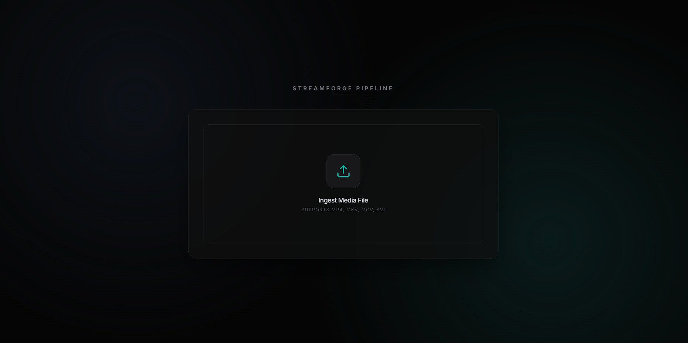

# HLS-Streaming-transcoder

A high-performance HLS (HTTP Live Streaming) transcoding engine built with FastAPI and FFmpeg. Supports asynchronous multi-bitrate processing (360p, 720p, 1080p) with real-time progress tracking.
